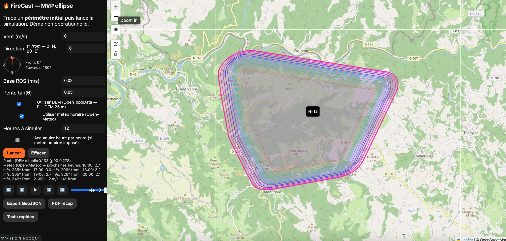

# FireCast



Prototype (MVP) de simulation de propagation d’incendie **temps réel** côté serveur (Flask) avec **visualisation Leaflet** côté client.

## 🧩 Idée générale

* Entrée : un **périmètre d’incendie** (polygone) dessiné sur la carte.
* Modèle MVP : **dilatations elliptiques** heure par heure (anisotropie vent + pente).
* Données externes :

  * **Pente** estimée via **OpenTopoData EU-DEM 25 m** (API publique).
  * **Vent horaire** via **Open-Meteo** (m/s et direction “from”).
* Sortie : **isochrones** H+1, H+2, … (GeoJSON) + **rapport PDF** (paramètres + carte).
* UX : **timeline** (slider + play/pause/vitesse), **boussole** from→towards, exports.

---

## ✨ Fonctionnalités

* **Dessin/édition** du périmètre (Leaflet + Leaflet.draw).
* **Propagation ellipse** (Shapely) :

  * orientation selon le **vent** (“from” → “towards”),
  * modulation simple par **pente** (facteur multiplicatif).
* **Météo horaire** (Open-Meteo) → vent variable dans le temps.
* **Pente** (OpenTopoData EU-DEM) → tan(θ) moyen sur la zone (échantillonnage adaptatif).
* **Timeline** : slider H+1…H+N, lecture **▶/⏸**, **⏮/⏭**, facteur **0.5× → 4×**.
* **Exports** : GeoJSON des isochrones, PDF récap.
* **Robustesse géométrique** : validation, nettoyage (snapping, `buffer(0)`), filtrage débris.
* **Self-tests** : aire croissante & inclusion H+1 ⊂ H+2.

---

## 📦 Installation

Prérequis : **Python 3.10+** (idéal 3.11).

```bash
python3 -m venv .venv
source .venv/bin/activate         # Windows: .venv\Scripts\activate
pip install -r requirements.txt
python app.py
```

Ouvre [http://localhost:5000](http://localhost:5000)

**requirements.txt**

```
Flask>=3.0
Shapely>=2.0
reportlab>=4.0
numpy>=1.24
requests>=2.31
```

### Variables optionnelles

* `FEUCAST_OPENTOPO_URL` (par défaut `https://api.opentopodata.org/v1/eudem25m`)
* `FEUCAST_OPENMETEO_URL` (par défaut `https://api.open-meteo.com/v1/forecast`)

---

## 🖥️ Utilisation (UI)

1. Dessine un polygone (périmètre initial).
2. Choisis **ROS base**, **vent** (ou coche *Utiliser météo horaire*), **pente** (ou coche *Utiliser DEM*).
3. Clique **Lancer**.
   → Isochrones affichées + **timeline** activée.
4. **Export** GeoJSON ou **PDF** si besoin.

---

## 🔌 API (rapide)

### `POST /api/simulate`

Body (ex.) :

```json
{
  "perimeter": { "type": "Polygon", "coordinates": [...] },
  "hours": 12,
  "base_ros_ms": 0.02,
  "wind_ms": 6.0,
  "wind_deg": 0.0,              // "from": 0=N, 90=E
  "slope_tan": 0.05,
  "accumulate": false,
  "use_dem": true,
  "use_meteo": true
}
```

Retour : `FeatureCollection` (isochrones) + `meta` (infos pente/météo utilisées).

### `GET /api/selftest`

Checks rapides (aire ↑, inclusion).

### `POST /api/report`

Entrée : `{ params: {...}, map_png: "data:image/png;base64,..." }`
Retour : PDF.

---

## ⚠️ Limites connues

* Modèle **ellipse** = pas d’obstacles, pas d’hétérogénéité fine.
* Pente = **moyenne** sur la zone (via échantillonnage DEM), pas de carte $\tan\theta(x,y)$.
* Vent horaire appliqué mais **isotrope** dans la ROS (approximation).
* Reprojection **Web Mercator** par formules (assez bonne à l’échelle locale).

---

## 🗺️ Données & crédits

* Fond de carte : © contributeurs **OpenStreetMap**.
* Relief (pente) : **EU-DEM 25 m** via **OpenTopoData** (API publique).
* Météo : **Open-Meteo** (vent 10 m).

---

## 🧭 Roadmap — Ce qui reste à faire

### 1) **TOA Eikonale / Fast Marching** (priorité)

Passage d’une géométrie “buffer ellipse” à une **carte de temps d’arrivée** $T(x,y)$ sur une **grille raster** en mètres en résolvant :

$$
|\nabla T(x,y)| = \frac{1}{R(x,y)}
$$

où $R$ = **ROS locale** (m/s).

**Pipeline visé :**

1. **Grille** (30–100 m) couvrant la zone + marge.
2. **Champ $R(x,y)$** = $R_0(\text{fuel}) \times f_\text{slope}(x,y) \times f_\text{wind}(x,y)$.
3. **Condition initiale** : $T=0$ sur le polygone (ignition).
4. **Fast Marching** (upwind, file de priorité) → raster **TOA** (secondes/heures).
5. **Produits** :

   * **Isochrones** = niveaux $T=1h,2h,\dots$,
   * **GeoTIFF (COG)** du TOA,
   * **Stats d’impact** (routes/bâtiments touchés à H+N).

**Vent variable dans le temps (MVP)** : *quasi-statique par heure*

* Pour chaque heure h : construire $R_h(x,y)$, résoudre pour Δt=1 h depuis le front courant, cumuler.

**Bénéfices** :

* Front **imbriqué** sans artefacts, gestion simple des **obstacles** (R≈0), hétérogénéité spatiale naturelle.

### 2) **ROS dépendante du type de couverture (WorldCover)**

* Télécharger **ESA WorldCover 10 m** (ou tuiles Cloud-Hosted/Cog).
* **Mapping** classes → $R_0$ (m/s) *indicatif* + facteurs :

  * Eau / urban → **R=0** (barrières).
  * Cultures / herbacé → R0 faible à médian.
  * Forêt / shrubland → R0 médian/élevé.
* Combiner avec **pente** (ex. $1+k_s \tan\theta$) et **vent** (ex. $1+k_w u/10$).
* Exposer un **profil** (sec/normal/humide) → facteur global.

### 3) **UX**

* **Heatmap** pente/ROS en overlay (aperçu $R(x,y)$).
* Mini **rose des vents** horaire.
* **Sauver/charger scénario** (JSON).

### 4) **Tests**

* **Tests** : monotonicité de $T$, cohérence isochrones, conversions CRS, fallbacks en erreur.
* **Logs** structurés (durée appels API, taux de cache).


---

## 📄 Licence

MIT